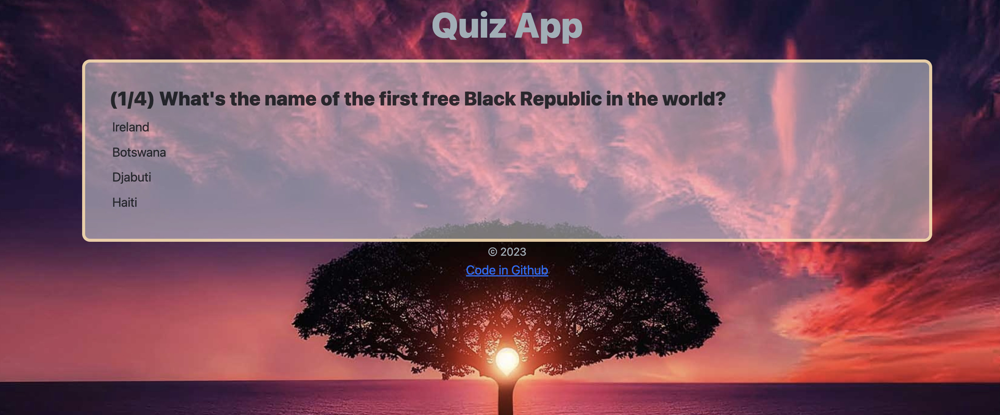

# Quiz App

Boca Code Week 5 Quiz App : A dynamic and engaging web application that offers an interactive quiz experience. 

## Features

- Multiple choice questions with options
- Dynamic scoring and progress tracking
- Final score calculation and display at the end of the quiz

## Technologies Used

- CSS
- JavaScript
- Bootstrap

## Getting Started

To run the Quiz App locally, follow these steps:

1. Clone the repository: `git clone https://github.com/v-cazeau/quiz-app.git`
2. Navigate to the project directory: `cd quiz-app`
3. Open the `index.html` file in your preferred web browser.

## Special thanks

Special thanks to [Boca Code](https://github.com/bocacode) for providing the learning environment and resources for this project.

---

*This project was developed as part of the Boca Code curriculum.*